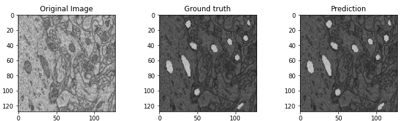
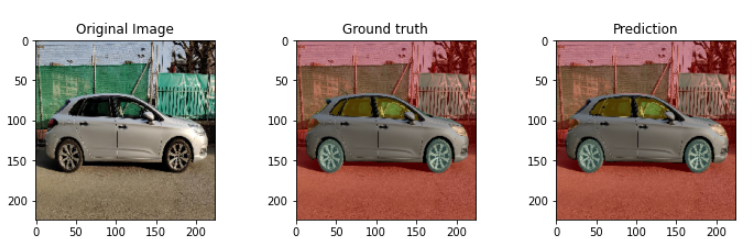

# Unet for image segmentation 
My project is inspired by original architecture: [U-Net: Convolutional Networks for Biomedical Image Segmentation](https://arxiv.org/abs/1505.04597) <br>
## Binary semantic segmentation 
### <a href = 'https://www.kaggle.com/maedemaftouni/covid19-ct-scan-lesion-segmentation-dataset'>COVID-19 CT scan lesion segmentation</a>
||||
|:---:|:---:|:---:|
| Origins | Groundtruth | Prediction |

<p>Review training on colab:</p>

- Unet -->  [](https://colab.research.google.com/drive/1hb_W3pPkB8Fs_n9c4Z6zyuL_yQkNHmOH?usp=sharing)
- Mobilenetv2 - Unet --> [](https://colab.research.google.com/drive/12oJvjjdJIXN1YAySF1LhfFgJ3dG0uHHT?usp=sharing) 
- Resnet50 - Unet --> [](https://colab.research.google.com/drive/1ROfmqetdu0Z4bRTRpH3dRJeH-FIFpcfT?usp=sharing)

### <a href = 'https://www.kaggle.com/dat0chin/electron-microscopy-dataset'>Mitochondria Segmentation</a>


Review training on colab: <br>

[](https://colab.research.google.com/drive/1Dct1nq5qa-iwCNnp1z50zXquJBJOM9JV?usp=sharing)

## Multiclass semantic segmentation with Resnet50-Unet (<a href = 'https://www.kaggle.com/intelecai/car-segmentation'>Car Segmentation</a>)


Review training on kaggle: <br>

[](https://www.kaggle.com/dat0chin/car-segmentation-with-resnet50-unet)

## Overview
In this my model, I will resize `INPUT_SHAPE` and `OUTPUT_SHAPE` equally. The reason is that when the dimensions are equal, the model will not lose position and spatial information. Some layers of the SOTA model module have an image mask that is resized to the same size as the input.<br>
To do so, I use `padding = same` and `LeakyRelu` as an alternative to `Relu` <br>

In addition, I have implemented Unet models with the encoding as the `Mobilenetv2 and Resnet50 backbones`
### Original Unet Architecture
<p align = "center"> 

</p>

### Author
<ul>
    <li>Github: <a href = "https://github.com/Nguyendat-bit">Nguyendat-bit</a> </li>
    <li>Email: <a href = "nduc0231@gmai.com">nduc0231@gmail</a></li>
    <li>Linkedin: <a href = "https://www.linkedin.com/in/nguyendat4801">Đạt Nguyễn Tiến</a></li>
</ul>

## Usage
### Dependencies
- python >= 3.9
- numpy >= 1.20.3
- tensorflow >= 2.7.0
- opencv >= 4.5.4
- matplotlib >= 3.4.3

### Train your model by running this command line

Training script:


```python

python train.py --all-train ${link_to_train_origin_folder} --all-train ${link_to_train_mask_folder} --epochs ${epochs}

```


Example:

```python

python train.py  --all-train frames/*.jpg --all-train masks/*.jpg --batch-size 4 --classes 2 --epochs 2 --color-mode gray --use-kmean True --image-size 64 

``` 

There are some important arguments for the script you should consider when running it:

- `all-train`: The folder of training data 
- `all-valid`: The folder of validation data
- `color-mode`: Where the model after training saved
- `lr`: The learning rate
- `image-size`: The image size of the dataset

## Feedback
If you meet any issues when using this library, please let us know via the issues submission tab.


